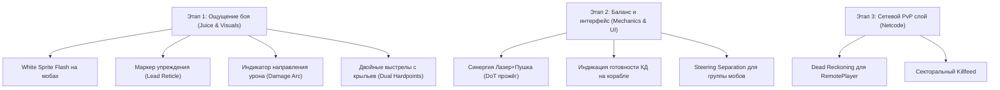

# Улучшения боевой системы Stellar Drift

Данный документ содержит комплексный технический и геймдизайнерский план по улучшению боевой системы **Stellar Drift** (стрельба, скиллы, визуал PvP/PvE, фидбек и сетевая синхронизация), составленный с учетом реальной архитектуры проекта, Phaser 4, клиент-серверного разделения и установленных правил баланса.

---

## 1. 🔫 Стрельба, баллистика и физика оружия

### 1.1. Маркер упреждения стрельбы (Lead Target Reticle)
* **Текущее состояние:** Игрок видит прицел на самом корабле цели. При стрельбе баллистической плазмой ($V_{proj} \approx 900\text{--}1100\,\text{px/s}$) по движущимся целям ручной упреждающий вынос прицела сложен и интуитивно непонятен.
* **Решение:** Внедрить динамический маркер упреждения $\mathbf{P}_{lead}$, рассчитываемый по векторам скорости цели и снаряда:
  $$\mathbf{P}_{lead} = \mathbf{P}_{target} + \mathbf{V}_{target} \cdot t_{hit}$$
  где $t_{hit}$ находим из квадратного уравнения:
  $$(\mathbf{V}_{target}^2 - V_{proj}^2) \cdot t^2 + 2(\mathbf{P}_{target} - \mathbf{P}_{player}) \cdot \mathbf{V}_{target} \cdot t + |\mathbf{P}_{target} - \mathbf{P}_{player}|^2 = 0$$

### 1.2. Микро-отдача и фидбек выстрела (Gun Juice)
* **Решение:**
  * **Отдача спрайта:** При выстреле из тяжелых орудий сдвигать спрайт игрока на $2\text{--}4\,\text{px}$ в противоположном выстрелу направлении с плавным возвратом (`tweens.add` за $80\,\text{мс}$).
  * **Микро-шейк:** Короткая встряска камеры ($1\text{--}2\,\text{px}$ на $50\,\text{мс}$) при критических выстрелах или активации способности `salvo`.

### 1.3. Трассировка отрезков перемещения снаряда (Raycast / Circle Sweep)
* **Текущее состояние:** В [Projectile.js](file:///C:/Work/stellar-drift/client/src/entities/Projectile.js#L86) проверка попадания производится простой дистанцией `Distance < hitRadius`.
* **Проблема:** На высоких скоростях или при просадках FPS снаряд может перепрыгнуть хитбокс цели за 1 кадр ($\Delta x = V \cdot dt > hitRadius$).
* **Решение:** Заменить точечную проверку на проверку пересечения отрезка перемещения за кадр $[X_{t-1}, Y_{t-1}] \rightarrow [X_t, Y_t]$ с радиусом хитбокса цели.

---

## 2. 🎨 Импакт, визуальный и звуковой отклик (Visual & Audio Juice)

### 2.1. Белая вспышка спрайта при получении урона (Sprite Hit Flash)
* **Текущее состояние:** При попадании по мобам вылетает только текст урона и вспышка `hitFlash` из партиклов. Сам спрайт моба не меняется.
* **Решение:** Добавить окрашивание спрайта чистым белым цветом на 1 кадр ($40\text{--}50\,\text{мс}$):
  ```javascript
  // В момент нанесения урона в Mob.js / Player.js
  this.sprite.setTintFill(0xffffff);
  this.scene.time.delayedCall(50, () => {
    if (this.sprite?.active) this.sprite.clearTint();
  });
  ```

### 2.2. Дуговой индикатор источника урона (Damage Direction Arc)
* **Текущее состояние:** При атаке из-за пределов экрана или со спины игрок видит только падение шкалы HP.
* **Решение:** Внедрить красный/пурпурный дуговой индикатор по краю HUD (Damage Arc), указывающий направление, откуда прилетел урон относительно текущего направления камеры.

### 2.3. Звуковая динамика (Audio Pitch & Ducking)
* **Решение:**
  * Добавить рандомизацию тональности выстрелов (`pitch = Phaser.Math.FloatBetween(0.95, 1.05)`) в [SoundManager.js](file:///C:/Work/stellar-drift/client/src/systems/SoundManager.js).
  * Внедрить **Audio Ducking**: кратковременное приглушение фоновой музыки на $-6\,\text{dB}$ в момент мощных взрывов или получения критического урона.

---

## 3. ⚡ Скиллы и синергия оружия игрока

> **Уточнение правил баланса:**
> 1. У игроков **нет ионного/кислотного/гравитационного оружия** (оно принадлежит исключительно арсеналу мобов). Игрок использует только плазменные пушки (`cannon`) и хитскан-лазеры (`laser`).
> 2. Восстановление щита во время боя **заблокировано** (задержка `shieldRegenDelaySec` = 6 сек у игрока в [Player.js:L688](file:///C:/Work/stellar-drift/client/src/entities/Player.js#L688), 20–30 сек у мобов в [Mob.js:L307](file:///C:/Work/stellar-drift/client/src/entities/Mob.js#L307)).

### 3.1. Ротация и синергия арсенала (Weapon Swap & Skill Chains)
* **Синергия «Пушка $\rightarrow$ Лазер»:** 
  * Плазменная пушка наносит основной урон по щитам.
  * Хитскан-лазер имеет свойство `weaponHullMult = 1.30` (увеличенный урон по корпусу).
  * **Комбо-эффект:** При падении щита цели ниже 15% выстрел из лазера наносит дополнительный **«Термический прожёг»** (DoT-урон перегрева по корпусу в течение 3 секунд).
* **Синергия «Перегрузка $\rightarrow$ Кинетический шок»:**
  * Критическое попадание плазменной пушкой под баффом `overcharge_shot` вызывает **«Кинетический шок»** — кратковременный сбой прицеливания моба на 0.5 секунды.

### 3.2. Визуализация готовности скиллов (CD Ready Visuals)
* **Решение:**
  * При завершении КД активной способности (особенно кнопки `0` корабля) проигрывать импульсную вспышку (CD Ready Pulse) вокруг корабля игрока.
  * Сопровождать откат скилла четким звуковым сигналом готовности, чтобы пилот не отвлекался на панель абилок внизу экрана.

---

## 4. 👾 PvE-бои, AI мобов и интерфейс прицеливания

> **Уточнение правил баланса:**
> 1. Телеграфирование атак **уже реализовано** для AoE-способностей и взрывных волн боссов (кольца, мины).
> 2. Для хитскан-лазеров телеграфы бессмысленны, так как от мгновенного луча невозможно увернуться в полете.

### 4.1. Взаимное расталкивание мобов (Steering Separation)
* **Проблема:** При аггре 10+ мобов они сливаются в один «слоеный пирог» из спрайтов из-за отсутствия физического выталкивания.
* **Решение:** Добавить вектор отталкивания между мобами (Separation Force):
  $$\mathbf{F}_{sep} = \sum_{j \neq i} \frac{\mathbf{P}_i - \mathbf{P}_j}{|\mathbf{P}_i - \mathbf{P}_j|^2} \cdot k_{repulse}$$

### 4.2. Маркер аггро/цели над элитными мобами (Targeting Indicator)
* **Решение:** Для элитных мобов и мини-боссов добавить компактный маркер над их полоской HP, показывающий, в какого именно пилота в группе моб залочен в данный момент. Это позволяет target-пилоту своевременно применить защитный навык (`aegis_dome` или `phantom_cloak`).

---

## 5. ⚔️ PvP-архитектура и сетевая синхронизация

### 5.1. Экстраполяция позиций (Dead Reckoning)
* **Текущее состояние:** Позиции соперников приходят с тикрейтом ~60мс и сглаживаются лерпом в [RemotePlayer.js](file:///C:/Work/stellar-drift/client/src/entities/RemotePlayer.js#L205). Из-за этого корабль противника визуально отстает от сервера на $60\text{--}100\,\text{мс}$.
* **Решение:** Добавить экстраполяцию целевой точки с учетом скорости:
  $$\mathbf{P}_{pred} = \mathbf{P}_{target} + \mathbf{V}_{target} \cdot \Delta t_{lag}$$

### 5.2. Лента убийств и визуализация уничтожения (PvP Killfeed & Finisher)
* **Решение:**
  * Добавить секторальную ленту убийств в верхнем правом углу HUD (`[PlayerA] 💥 [PlayerB]`).
  * При уничтожении корабля соперника проигрывать расширенный эффект взрыва с разлетающимися обломками корпуса и коротким эффектом ударной волны.

---

## 6. 🚀 Орудийные точки (Dual Hardpoints) и геометрия выстрелов

### 6.1. Разделение визуала снарядов игроков и мобов (Visual Clarity)
* **Проблема:** Сейчас выстрел игрока и моба использует один и тот же спрайт капсулы (`bolt_sprite`), отличающийся только тинтом. В замесе сложно мгновенно различить выстрелы вражеских мобов, союзников и соперников.
* **Решение:**
  * **Игроки:** Использовать стреловидные неоновые «плазменные иглы» (Plasma Needles) с ярким циановым `#00e5ff` или оранжевым `#ff6d00` свечением.
  * **Обычные мобы:** Округлые плазменные сферы/капли (Plasma Orbs) с алым или ядовито-зеленым свечением.
  * **Боссы (Аргус/Поезд):** Зубчатые нестабильные энергетические разряды повышенного размера.

### 6.2. Двойной выстрел из крыльев (Dual Muzzle Hardpoints)
* **Текущее состояние:** Все выстрелы вылетают из географического центра корабля `(p.x, p.y)`.
* **Решение:** Рассчитывать точки спавна орудий по геометрии крыльев корабля с учетом угла поворота $\theta$:
  $$\mathbf{u} = (\cos\theta, \, \sin\theta), \quad \mathbf{n} = (-\sin\theta, \, \cos\theta)$$
  $$X_{left} = X_{ship} + F \cdot \cos\theta - W \cdot \sin\theta, \quad Y_{left} = Y_{ship} + F \cdot \sin\theta + W \cdot \cos\theta$$
  $$X_{right} = X_{ship} + F \cdot \cos\theta + W \cdot \sin\theta, \quad Y_{right} = Y_{ship} + F \cdot \sin\theta - W \cdot \cos\theta$$
  где $W$ — полуширина крыльев ($15\text{--}25\,\text{px}$), $F$ — вынос к носу ($10\text{--}20\,\text{px}$).

### 6.3. Режимы стрельбы: Залп vs Поочередный огонь
* **Сдвоенный синхронный залп (Twin Shot):** Одно нажатие спавнит сразу 2 плазменных снаряда с левого и правого крыла, сходящихся к точке прицеливания $\mathbf{P}_{lead}$.
* **Поочередный огонь (Alternate Wing Fire):** Выстрелы идут поочередно (лево $\rightarrow$ право $\rightarrow$ лево), создавая динамичный ритм скорострельности.

### 6.4. Многоствольные схемы для Боссов
* Для Аргуса и элитных кораблей внедрить **4-ствольную батарею** спавна (выстрел каскадом по 4 точкам корпуса $1 \rightarrow 2 \rightarrow 3 \rightarrow 4$), подчеркивающую техническую превосходность и габариты босса.

---

## 7. 🗺 Дорожная карта реализации (Roadmap)


