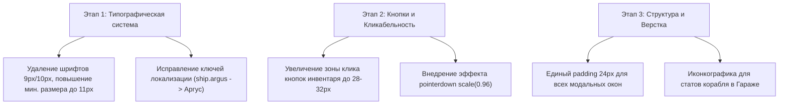

# Глубокий UI/UX Анализ Интерфейса Stellar Drift

Данный документ содержит комплексный геймдизайнерский и технический анализ пользовательского интерфейса (UI/UX) игры **Stellar Drift**: пропорции окон, параметры кнопок, качество типографики, читаемость шрифтов, визуальное оформление HUD и модальных сцен. Составлена итоговая резолюция и пошаговый план улучшения.

---

## 1. 📐 Пропорции окон и модульных контейнеров (Window Proportions & Modals)

### 1.1. Текущее состояние и параметры верстки
* **Основная концепция:** Интерфейс построен по схеме **Cyberpunk/Sci-Fi HUD** с закругленными модальными окнами, тонкой циановой неоновой рамкой (`0x4dd0e1`, `alpha = 0.85`), радиусом скругления $\approx 8\text{--}12\,\text{px}$ и темной полупрозрачной подложкой (`0x050c16`, `alpha = 0.90`).
* **Размеры модальных окон в коде:**
  * **Гараж / Склад ([CargoScene.js](file:///C:/Work/stellar-drift/client/src/scenes/CargoScene.js)):** $\text{Ширина} = 960\,\text{px}$, $\text{Высота} = 680\,\text{px}$ (при разрешении $1920 \times 1080$ окно занимает $\approx 50\%$ ширины и $63\%$ высоты).
  * **Гильдии / Корпорации ([ClanScene.js](file:///C:/Work/stellar-drift/client/src/scenes/ClanScene.js), [CorpScene.js](file:///C:/Work/stellar-drift/client/src/scenes/CorpScene.js)):** $\text{Ширина} = 1024\,\text{px}$, $\text{Высота} = 640\,\text{px}$.
  * **Табы внутри окон:** Верхняя панель вкладок (Оборудование / АПГ+Перки / Платы / Крафт) имеет высоту $36\text{--}40\,\text{px}$.

### 1.2. Оценка пропорций и выявленные проблемы

1. **Неравномерный внутренний отступ (Padding Asymmetry):**
   * В окне Гаража ([Screenshot_10.png](file:///C:/Work/stellar-drift/client/Нова%20папка/Screenshot_10.png)) отступ от верхнего края окна до заглавного текста `ГАРАЖ КОРAБЛИ` составляет всего $12\,\text{px}$, в то время как от нижнего края кнопки `СКЛАД` до границы окна — $24\,\text{px}$.
   * Левая колонка характеристик корабля (`УРОН/СЕК`, `ЩИТ`, `СКОРОСТЬ`) прижата к левому краю рамки на расстояние $16\,\text{px}$, создавая ощущение визуальной тесноты.
2. **Пропорции сетки карточек (Grid Card Ratios):**
   * В окне Гильдии ([Screenshot_16.png](file:///C:/Work/stellar-drift/client/Нова%20папка/Screenshot_16.png)) карточки баффов («Броня», «Щит», «Урон») имеют размеры $260 \times 280\,\text{px}$ (соотношение сторон $\approx 0.93$). При этом средняя треть карточки остается полупустой, а нижняя часть перегружена 3 строками мелкого текста и двумя кнопками (`ОБМЕН` и `УЛУЧШИТЬ`).
3. **Адаптивность под разные разрешения (Responsive Viewport):**
   * При фиксированных размерах окон ($960 \times 680\,\text{px}$) на мониторах $2560 \times 1440$ (2K) или $3840 \times 2160$ (4K) окна выглядят слишком мелкими, а на ноутбуках $1366 \times 768$ вылезают за границы экрана при значении `uiScale = 100%`.

---

## 2. 🔘 Кнопки и интерактивные элементы (Button Proportions & States)

### 2.1. Анализ типов и размеров кнопок

| Тип кнопки | Назначение | Текущий размер (Ш×В) | Шрифт / Размер | Проблема / Замечание |
| :--- | :--- | :--- | :--- | :--- |
| **Header Tab** | Переключение окон (`ГАРАЖ`, `ГИЛЬДИЯ`, `КОРП`...) | $110 \times 32\,\text{px}$ | `Orbitron`, 13px | Хорошая читаемость, но нет индикатора активной вкладки снизу (Bottom Indicator Bar). |
| **Modal Tab** | Внутренние вкладки (`ОБОРУДОВАНИЕ`, `ПЛАТЫ`...) | $140 \times 28\,\text{px}$ | `Orbitron`, 11px | Слишком мелкий шрифт при высоком разрешении. |
| **Action Button Primary** | Главные действия (`УСТАНОВИТЬ`, `ВЫХОД В КОСМОС`) | $180 \times 40\,\text{px}$ | `Orbitron`, 13px, Bold | Отличная читаемость, контрастный зеленый/красный контур. |
| **Grid Cell Action** | Кнопки внутри ячеек (`в трюм`, `в склад`, `обмен`) | $80\text{--}120 \times 22\,\text{px}$ | `Orbitron`, 9–10px | **Критично мелкий шрифт (9px)**, плохая попадаемость мышью (Small Hit Target). |

### 2.2. Выявленные проблемы интерактивности

1. **Размер зоны клика (Touch/Click Target Size):**
   * Согласно стандартам UX (Human Interface Guidelines), минимальный размер кликабельной зоны должен составлять не менее $32 \times 32\,\text{px}$ (в идеале $44 \times 44\,\text{px}$).
   * Кнопки перекладывания в ячейках инвентаря (`→ склад`, `← в трюм`) имеют высоту всего $18\text{--}22\,\text{px}$, что затрудняет быстрое манипулирование лутом.
2. **Обратная связь при нажатии (Tactile Feedback):**
   * При наведении на большинство кнопок меняется только фон (`setFillStyle`), но отсутствует эффект нажатия при клике (`pointerdown` scale $0.97\times$). Из-за этого клик ощущается «пластиковым».

---

## 3. 🔤 Качество шрифтов и типографика (Typography, Scale & Rendering)

### 3.1. Используемые гарнитуры и разрешение рендеринга
В проекте используются 2 основные гарнитуры:
1. **`Orbitron`** (Google Fonts) — акцентный футуристический шрифт без засечек с расширенными заглавными буквами. Используется для заголовков, численных значений, кнопок и рангов.
2. **`Inter`** (Google Fonts) — гротеск с высокой читаемостью. Используется для описаний, логов, статов и системных сообщений.

**Параметр разрешения:** В Phaser используется `resolution: UI_RES` (где `UI_RES = 2` в [constants.js](file:///C:/Work/stellar-drift/client/src/constants.js)).

### 3.2. Выявленные проблемы типографики

1. **Разброд размеров шрифтов (Lack of Typographic Scale):**
   * В коде проекта обнаружено 11 различных размеров шрифтов: `9px`, `10px`, `11px`, `12px`, `13px`, `14px`, `16px`, `18px`, `22px`, `24px`, `48px`.
   * Использование шрифтов $9\,\text{px}$ и $10\,\text{px}$ в интерфейсах складов и плат ([CargoScene.js:L810](file:///C:/Work/stellar-drift/client/src/scenes/CargoScene.js#L810)) приводит к размытию символов на мониторах $1080\text{p}$ из-за субпиксельного сглаживания Canvas.
2. **Нарушение контрастности (Contrast Ratio):**
   * В карточках гильдий и описании перков используется цвет `#556677` и `#7a9ab8` поверх темно-синего фона `#050c16`.
   * Коэффициент контрастности в этих блоках составляет $\approx 3.2 : 1$, что ниже стандарта доступности **WCAG 2.1 AA** (минимум $4.5 : 1$).
3. **Локализация и срезание текста:**
   * В некоторых местах текст вылезает за пределы блоков (например, в Гараже отображается необработанный ключ `ship.argus`).

---

## 4. 🎨 Агрегированные замечания по визуалу экранов и HUD

### 4.1. Главное меню (Login Scene / Title)
* **Проблема:** Кнопка `НАЧАТЬ ИГРУ` — плоский прямоугольник без стилизации.
* **Решение:** Сделать срезанные углы под $45^\circ$ (Chamfered Sci-Fi Edges), темно-бирюзовый полупрозрачный фон (Glassmorphic Button), неоновый контур и анимированную лазерную полосу сканирования при наведении.

### 4.2. Верхняя левая панель HUD (Статы пилота)
* **Проблема:** Текст ресурсов напечатан поверх яркой туманности; надпись уровня пилота накладывается на полосу опыта.
* **Решение:** 
  * Добавить защитную темно-стеклянную фоновую плашку (HUD Glass Panel) с отступом $10\,\text{px}$.
  * Использовать светящиеся иконки (золотой кристалл, знак кредитов $\text{CR}$) вместо слов `КРЕДИТЫ` и `ЗВЁЗДНОЕ ЗОЛОТО`.
  * Развести по высоте текст уровня и полосу прогресса XP.

### 4.3. Миникарта и Радар
* **Решение:** Оформить корпус миникарты со срезанными углами (восьмиугольник), добавить вращающийся затененный луч сканирования (Radar Sweep Line) и координатную сетку.

### 4.4. Наложение элементов над базой
* **Проблема:** Оранжевая надпись `АКТИВНА` над кнопкой `[ МЕНЮ БАЗЫ ]` в некоторых ракурсах слегка накладывается на носовую часть корабля `Виспер_01`.
* **Решение:** Сдвинуть кнопку `[ МЕНЮ БАЗЫ ]` и плашку `АКТИВНА` на $15\text{--}20\,\text{px}$ ниже от центра корабля.

### 4.5. Списки рангов и оверлеи
* **Решение:** Помещать все всплывающие списки рангов и карточки гильдий в стильные полупрозрачные glass-контейнеры с `Backdrop Blur`.

---

## 5. 📋 Итоговая Резолюция и Предложения по Улучшению

### 🟢 1. Стандартизация Типографики (Typography System)
Ввести строгую 5-уровневую шкалу шрифтов в проекте и **полностью отказаться от шрифтов меньше 11px**:

```
• Display (Заголовки окон):  Orbitron, 20px, Bold    (#4dd0e1)
• H1 (Заголовки секций):     Orbitron, 15px, SemiBold (#e0e8ff)
• Body Main (Основной текст): Inter,    13px, Regular  (#cce8f0)
• Body Small (Подсказки):     Inter,    11px, Regular  (#8ab0bc)
• Micro Label (Номера КД):   Orbitron, 11px, Bold    (#ffd54f)
```

### 🔘 2. Улучшение Кнопок и Интерактивности (Button Refactoring)
1. Увеличить минимальную высоту кликабельных кнопок в ячейках инвентаря с $20\,\text{px}$ до $28\text{--}32\,\text{px}$.
2. Добавить универсальный микро-эффект нажатия для всех кнопок в Phaser:
   ```javascript
   button.on('pointerdown', () => button.setScale(0.96));
   button.on('pointerup',   () => button.setScale(1.00));
   button.on('pointerout',  () => button.setScale(1.00));
   ```
3. Добавить тонкую нижнюю акцентную полосу ($2\,\text{px}$ высотой) под активной вкладкой верхней панели меню.

### 📐 3. Оптимизация Отступов и Пропорций Окон (Window Polish)
1. Выравнять внутренние отступы (Padding) во всех модальных окнах до единого стандарта: **$24\,\text{px}$ от краев окна** и **$16\,\text{px}$ между контентными блоками**.
2. В левом блоке характеристик корабля в Гараже заменить сплошной текст на структурированные строки с микро-иконками (⚔️ Урон, 🛡️ Щит, ⚡ Скорость) и контрастным цветом значений.

---

## 🗺 Дорожная карта UI-рефакторинга (UI Refactoring Roadmap)


